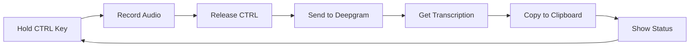

# Push-to-Talk Medical Dictation Tool - Technical Plan

## Overview
A lightweight, portable Windows executable for medical dictation using Deepgram Nova-3 Medical model with push-to-talk functionality.

## Key Design Decisions

### 1. Portability & IT Compliance
- **Single .exe file** - No installation required
- **Minimal dependencies** - All bundled within executable
- **No admin rights needed** - Runs in user space
- **Clean code signing** - Reduces antivirus false positives

### 2. Core Functionality



### 3. Technical Stack

#### Essential Dependencies (bundled in .exe):
- **deepgram-sdk**: Official SDK for API connection
- **pyaudio**: Audio capture
- **pynput**: Keyboard listener for push-to-talk
- **pyperclip**: Cross-platform clipboard
- **websocket-client**: For real-time streaming

#### Build Tools:
- **PyInstaller**: Creates single executable
- **UPX**: Compression (optional, reduces size ~50%)

### 4. Application Flow

1. **Launch**: Double-click .exe file
2. **API Key Input**: Secure prompt (masked input)
3. **Display Mode Selection**: Choose preview mode (Y/N)
4. **Ready State**: Shows "Press and hold CTRL to record"
5. **Recording**: Hold CTRL (left or right), see "Recording..." indicator
6. **Processing**: Release CTRL, see "Transcribing..."
7. **Preview** (if enabled):
   - Shows transcribed text
   - Press ENTER to copy to clipboard
   - Press ESC to discard
8. **Complete**: Text copied to clipboard, shows "Copied!"
9. **Repeat**: Ready for next recording

### 5. Security Features

- API key never saved to disk
- Masked password input
- Memory-only operation
- No network traffic except to Deepgram
- No telemetry or logging

### 6. User Interface (Console)

```
========================================
   Deepgram Medical Dictation Tool
========================================

[Status: Ready]
Display Mode: [Preview ON/OFF]

Instructions:
- Hold CTRL to record (left or right)
- Release to transcribe
- Preview mode: Review before copying
- Auto mode: Direct to clipboard
- Press 'P' to toggle preview mode
- Press ESC to exit

Last transcription: [First 50 chars...]

Preview Window (when enabled):
----------------------------------------
Transcribed Text:
[Full transcription appears here]

[ENTER] Copy to clipboard  [ESC] Discard
----------------------------------------
```

### 7. Error Handling

- Network connection issues → Retry with backoff
- Microphone access denied → Clear error message
- API key invalid → Prompt to re-enter
- Audio device issues → Auto-detect available devices

### 8. Configuration File

The application will look for an optional `config.json` file in the same directory as the executable. If not found, it uses defaults.

```json
{
  "api_key": "",                    // Optional: Save API key (encrypted)
  "push_to_talk_key": "ctrl",       // Options: ctrl, alt, shift, f1-f12
  "preview_mode": true,              // Show text before copying
  "auto_punctuation": true,          // Deepgram auto punctuation
  "model": "nova-2-medical",         // Deepgram model selection
  "language": "en-US",               // Language code
  "save_transcriptions": false,      // Save to local file
  "transcription_folder": "./transcriptions",
  "sound_feedback": true,            // Beep on start/stop recording
  "min_recording_duration": 0.5,     // Minimum seconds to record
  "max_recording_duration": 300,     // Maximum seconds (5 minutes)
  "logging": {
    "enabled": false,                // Enable/disable logging
    "level": "INFO",                 // DEBUG, INFO, WARNING, ERROR
    "file": "./logs/dictation.log",  // Log file location
    "max_size_mb": 10,               // Max log file size before rotation
    "keep_days": 7,                  // Days to keep old logs
    "console_output": false,          // Also show logs in console
    "privacy_mode": true             // Redact transcribed text from logs
  }
}
```

### 9. Logging System

#### Features:
- **Privacy-First**: Option to redact transcribed text from logs
- **Rotating Logs**: Automatic file rotation to prevent disk space issues
- **Debug Levels**: Configurable verbosity (DEBUG, INFO, WARNING, ERROR)
- **Dual Output**: Optional console output for immediate feedback
- **Performance Metrics**: Log recording duration, API response times
- **Error Tracking**: Detailed error messages with stack traces

#### Log Format:
```
2024-01-15 10:23:45 [INFO] Application started
2024-01-15 10:23:46 [INFO] Config loaded from: ./config.json
2024-01-15 10:23:47 [INFO] Microphone initialized: Realtek Audio
2024-01-15 10:23:50 [INFO] Connected to Deepgram API
2024-01-15 10:24:01 [INFO] Recording started (CTRL pressed)
2024-01-15 10:24:05 [INFO] Recording stopped (4.2 seconds)
2024-01-15 10:24:06 [INFO] Transcription received (confidence: 0.95)
2024-01-15 10:24:06 [DEBUG] Text: [REDACTED - privacy mode enabled]
2024-01-15 10:24:06 [INFO] Text copied to clipboard
```

### 10. File Structure

```
project/
├── deepgram_dictation.py    # Main application
├── config_manager.py         # Configuration handling
├── logger.py                 # Logging system
├── requirements.txt          # Dependencies
├── build.py                  # PyInstaller build script
├── README.md                 # User documentation
├── config.json              # Optional configuration (template)
└── dist/
    ├── deepgram_dictation.exe  # Final executable
    ├── config.json             # User can place config here
    └── logs/                   # Log files directory (auto-created)
        └── dictation.log       # Current log file
```

### 11. Build Configuration

PyInstaller settings to avoid antivirus issues:
- Use `--onefile` for single executable
- Add `--windowed=False` for console app
- Include `--add-data` for any config files
- Use `--clean` to ensure fresh build
- Consider `--key` for bytecode encryption

### 12. Estimated Executable Size

- Base: ~25-30 MB
- With UPX compression: ~12-15 MB
- Config file: < 1 KB (optional)
- Acceptable for most IT policies

### 13. Portability Features

- Executable looks for config.json in its own directory
- Falls back to defaults if no config found
- Config can be edited with any text editor
- API key can be stored encrypted (optional)
- All settings can be overridden at runtime
- Logs stored locally in portable directory structure

### 14. Debug Mode Features

When logging is enabled with DEBUG level:
- Network request/response details (without sensitive data)
- Audio device information and settings
- Memory usage statistics
- Timing information for each operation
- WebSocket connection state changes
- Audio buffer statistics
- Clipboard operation confirmations

Press 'L' during runtime to toggle logging on/off temporarily.

## Next Steps

1. Implement the Python script with all functionality
2. Test on development machine
3. Build executable with PyInstaller
4. Test on clean Windows systems
5. Document any potential IT policy considerations